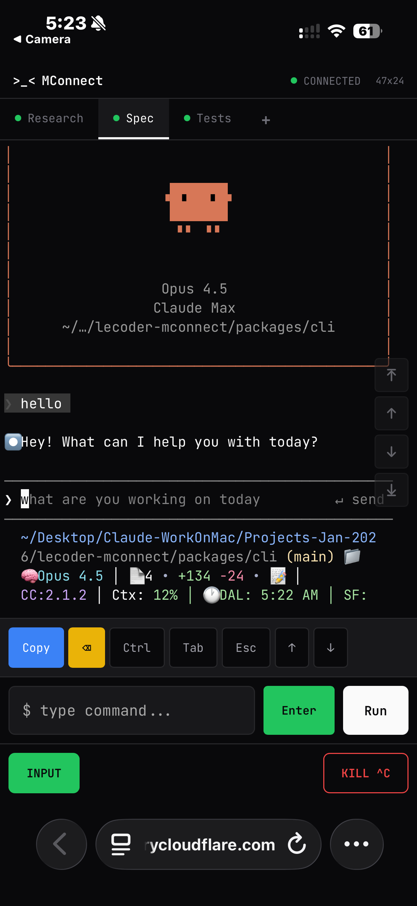

# LeCoder MConnect

<div align="center">

**📱 Terminal in your pocket**

Control your AI coding agents from anywhere with your phone.

[](https://www.npmjs.com/package/lecoder-mconnect)
[](https://opensource.org/licenses/MIT)
[](https://nodejs.org)
[]()

</div>

---

## What is MConnect?

MConnect lets you monitor and control long-running AI coding agents (Claude Code, Gemini CLI, Cursor Agent, etc.) from your phone. Run multiple AI agents simultaneously on your laptop and manage them remotely - perfect for when you step away but want to keep an eye on your agents.

<div align="center">

### 📸 Mobile Screenshots

| Claude Code | Cursor Agent | Gemini CLI |
|:---:|:---:|:---:|
|  |  |  |

*Control Claude Code, Cursor Agent, Gemini CLI and more from your phone*

</div>

## ✨ Features

- **🤖 Multi-Agent Support** - Run Claude Code, Gemini CLI, Cursor Agent, Codex, Aider in parallel
- **📱 Mobile-First UI** - Touch-optimized terminal with smooth scrolling
- **🔒 Read-Only by Default** - Safely monitor without accidental interruption
- **🌐 Secure Remote Access** - Cloudflare Tunnel (no port forwarding needed)
- **🛡️ Guardrails** - Block dangerous commands, require approval for risky ones
- **📷 QR Code Connect** - Scan to connect instantly
- **⚡ Shell-First Architecture** - Reliable PTY handling that actually works

## 🚀 Quick Start

### Prerequisites

- **Node.js 20+** (required)
- **Python 3** (for node-pty compilation)
- **C++ compiler** (Xcode CLI tools on macOS, build-essential on Linux)
- **cloudflared** (for remote access)
- **tmux** (optional, for server-side visualization)

### Installation

```bash
# Install cloudflared (required for remote access)
# macOS
brew install cloudflared

# Linux - see https://developers.cloudflare.com/cloudflare-one/connections/connect-networks/downloads/

# Install MConnect globally
npm install -g lecoder-mconnect

# Or run directly with npx
npx lecoder-mconnect

# Verify all dependencies
mconnect doctor

# Start MConnect
mconnect
```

### First Run

1. Run `mconnect` in your terminal
2. Select your agent configuration (e.g., "Research + Spec + Tests" for 3 parallel agents)
3. Choose guardrails level (default recommended)
4. Confirm working directory
5. **Scan the QR code** with your phone
6. Control your agents from anywhere!

## 🎮 Usage

### CLI Commands

```bash
# Start a new session (interactive)
mconnect

# Start with specific preset
mconnect start --preset research-spec-test

# Run system diagnostics
mconnect doctor

# List available presets
mconnect presets
```

### Command Options

| Option | Description | Default |
|--------|-------------|---------|
| `-d, --dir <path>` | Working directory | Current directory |
| `-p, --preset <name>` | Agent preset | Interactive selection |
| `-g, --guardrails <level>` | Security level | `default` |
| `--port <number>` | Server port | `8765` |
| `--no-tmux` | Disable tmux | Enabled |

### Agent Presets

| Preset | Agents | Best For |
|--------|--------|----------|
| **Shell Session** | 1 shell | Getting started |
| **Single Agent** | 1 AI agent | Simple tasks |
| **Research + Spec + Tests** | 3 agents | Parallel workflows |
| **Dev + Reviewer** | 2 agents | Code review |
| **Custom** | You choose | Advanced setups |

## 🛡️ Security

MConnect takes security seriously:

| Feature | Description |
|---------|-------------|
| **Token Auth** | Cryptographically secure session tokens |
| **Rate Limiting** | Protection against connection flooding |
| **Input Sanitization** | Blocks injection attacks |
| **Guardrails** | Configurable command blocking |
| **Tunnel Encryption** | All traffic encrypted via Cloudflare |
| **No Persistence** | Sessions are ephemeral |

### Guardrail Levels

| Level | Blocked Commands | Requires Approval |
|-------|-----------------|-------------------|
| **Default** | `rm -rf /`, fork bombs | Force push, npm publish |
| **Strict** | All destructive ops | Any rm, all git push |
| **Permissive** | Only catastrophic | Force push only |
| **None** | Nothing | Nothing |

## 🏗️ Architecture

```
┌─────────────────────────────────────────────────────────────────┐
│  YOUR LAPTOP                                                     │
│  ┌───────────────────────────────────────────────────────────┐  │
│  │  MConnect CLI                                              │  │
│  │  ┌─────────────┐  ┌─────────────┐  ┌─────────────────┐   │  │
│  │  │ PTY Manager │  │ Agent       │  │ Tmux Manager    │   │  │
│  │  │ (node-pty)  │  │ Manager     │  │ (visualization) │   │  │
│  │  └──────┬──────┘  └──────┬──────┘  └────────┬────────┘   │  │
│  │         └────────────────┴──────────────────┘             │  │
│  │                          │                                 │  │
│  │              ┌───────────┴───────────┐                    │  │
│  │              │   WebSocket Hub       │                    │  │
│  │              │   (multiplexed)       │                    │  │
│  │              └───────────────────────┘                    │  │
│  └───────────────────────────────────────────────────────────┘  │
└──────────────────────────────┬───────────────────────────────────┘
                               │ Cloudflare Tunnel (encrypted)
                               ▼
┌─────────────────────────────────────────────────────────────────┐
│  YOUR PHONE                                                      │
│  ┌───────────────────────────────────────────────────────────┐  │
│  │  Mobile Web UI                                             │  │
│  │  ┌─────────┐ ┌─────────┐ ┌─────────┐                      │  │
│  │  │Research │ │  Spec   │ │  Tests  │  ← Agent Tabs        │  │
│  │  └─────────┘ └─────────┘ └─────────┘                      │  │
│  │  ┌───────────────────────────────────────────────────┐    │  │
│  │  │  xterm.js Terminal                                │    │  │
│  │  │  - Touch scrolling                                │    │  │
│  │  │  - TUI app support (Claude Code, vim, etc.)      │    │  │
│  │  └───────────────────────────────────────────────────┘    │  │
│  │  [Enter] [Copy] [Ctrl] [Tab] [Esc] [↑] [↓] [^C]          │  │
│  │  ┌─────────────────────────────────────┐ ┌─────┐          │  │
│  │  │ $ type command...                   │ │ Run │          │  │
│  │  └─────────────────────────────────────┘ └─────┘          │  │
│  │  [INPUT MODE]                            [KILL ^C]        │  │
│  └───────────────────────────────────────────────────────────┘  │
└─────────────────────────────────────────────────────────────────┘
```

## 🤖 Supported AI Agents

| Agent | Status | Notes |
|-------|--------|-------|
| Claude Code | ✅ Tested | Full TUI support |
| Gemini CLI | ✅ Tested | Full TUI support |
| Cursor Agent | ✅ Tested | Full TUI support |
| OpenAI Codex | ✅ Supported | Shell mode |
| Aider | ✅ Supported | Shell mode |
| Custom | ✅ Supported | Any CLI tool |

## 🔧 Development

```bash
# Clone
git clone https://github.com/aryateja2106/lecoder-mconnect.git
cd lecoder-mconnect

# Install dependencies
npm install

# Build
npm run build --workspace=lecoder-mconnect

# Run tests
npm run test

# Run with coverage
cd packages/cli && npm run test:coverage

# Start development (watches for changes)
cd packages/cli && npm run dev
```

## 🐛 Troubleshooting

### `posix_spawnp failed` error

Fixed in v0.1.2 with shell-first architecture. Make sure you're using the latest version:
```bash
npm install -g lecoder-mconnect@latest
mconnect doctor
```

### node-pty installation fails

```bash
# macOS - ensure Xcode CLI tools
xcode-select --install

# Linux - ensure build tools
sudo apt install build-essential python3

# Then reinstall
npm install -g lecoder-mconnect
```

### Check all dependencies

```bash
mconnect doctor
```

### Tunnel not connecting

Ensure cloudflared is installed and accessible:
```bash
cloudflared --version
```

## 🔒 Privacy

- **No accounts** - No signup required
- **No cloud storage** - All data stays on your machine
- **Ephemeral sessions** - URLs expire when CLI stops
- **No telemetry** - We don't track anything

## 📄 License

MIT License - see [LICENSE](LICENSE) for details.

## 👤 Author

**Arya Teja Rudraraju** ([@aryateja2106](https://github.com/aryateja2106))

Part of the [LeCoder](https://github.com/aryateja2106/lecoder) project.

---

<div align="center">

**⭐ Star this repo if you find it useful!**

</div>
