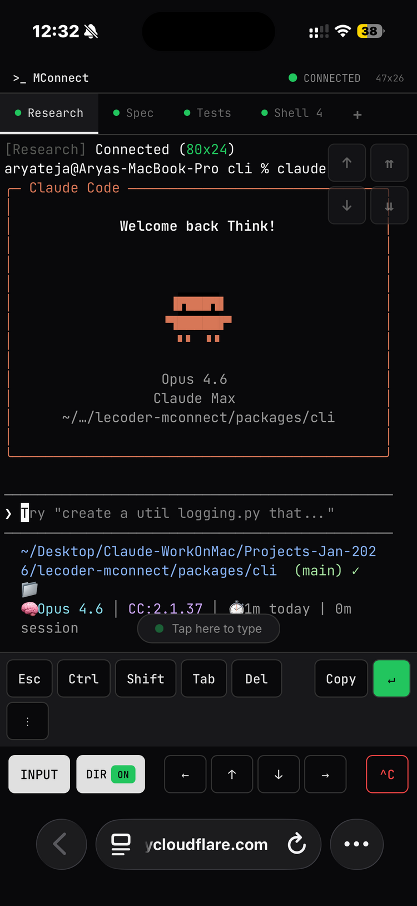
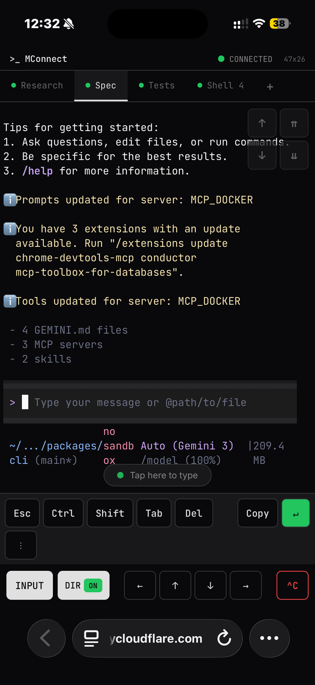
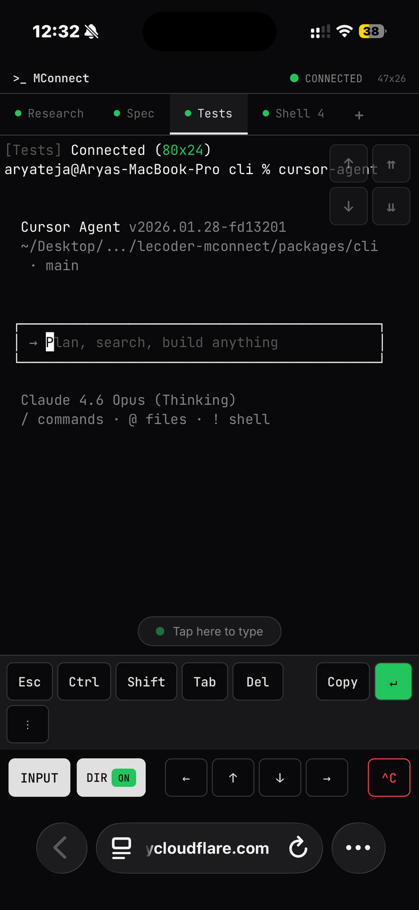
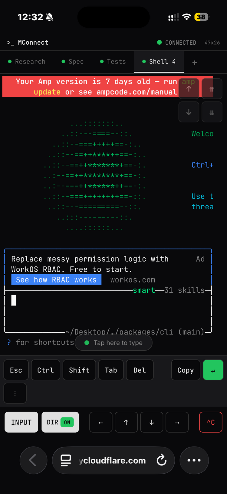
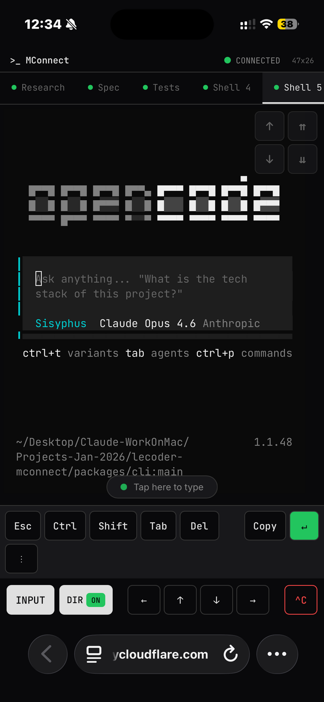

# LeCoder MConnect

**One command to control any AI coding agent from your phone.**

[](https://www.npmjs.com/package/lecoder-mconnect)
[](https://opensource.org/licenses/MIT)
[](https://www.comet.com/opik)

[](https://testflight.apple.com/join/pB2TbMrX)

> Control your AI coding agents from your phone. Now available on [TestFlight](https://testflight.apple.com/join/pB2TbMrX), App Store review in progress.

---

## The Problem

AI coding agents like Claude Code, Gemini CLI, and Cursor are incredibly powerful, but they're chained to your laptop. Step away from your desk and your agent stalls, waiting for approval on a file deletion or a package install. You lose time. The agent loses momentum.

Developers shouldn't have to babysit a terminal to stay productive.

## What MConnect Does

MConnect gives you full terminal control of your AI coding agents from your phone. One command, one QR scan, and you're connected.

```bash
npx lecoder-mconnect
```

That's it. A QR code appears in your terminal. Scan it with your phone. You're now controlling your AI agent from anywhere, with every action traced through [Opik](https://www.comet.com/opik) for full observability.

| Claude Code | Gemini CLI | Cursor Agent | Amp | OpenCode |
|:---:|:---:|:---:|:---:|:---:|
|  |  |  |  |  |

## Demo

[Watch the demo video](https://youtu.be/y1kwYfyJZRY) showing MConnect controlling Claude Code from an iPhone, with live Opik tracing.

**Live demo**: [lecoder.lesearch.ai](https://lecoder.lesearch.ai)

---

## Opik Integration

Most remote terminal tools give you zero visibility into what your AI agents are actually doing. MConnect is different. Opik observability is built into the core, not bolted on as an afterthought. Every meaningful action that happens in a session gets traced, giving you a clear picture of how your agents behave over time.

### What gets traced

MConnect runs two complementary Opik tracers that capture different levels of detail:

**Session-level tracing** tracks the full lifecycle of your MConnect session as a root trace, with nested spans for each event:

- **Agent spans** — when an agent (Claude Code, Gemini CLI, etc.) spawns, what type it is, and when it exits
- **Command spans** — every command that gets executed, whether it was blocked by guardrails, required approval, or ran directly
- **Approval spans** — when a command needs user approval (like `rm -rf` or `npm publish`), the request and the user's decision are captured
- **Client connection spans** — when a mobile or PC client connects/disconnects, including connection type and duration

**Observability-level tracing** captures system-wide metrics across the session:

- Input/output byte counts
- Container lifecycle events (create, start, stop, error)
- PTY process spawns and exits
- Security events (injection detection, rate limiting, auth failures)
- Tunnel creation success/failure
- Component initialization status
- Input arbitration decisions (who has control, accepted vs rejected inputs)

### Metrics we track

Every session accumulates these metrics, flushed to Opik on session end:

| Metric | What it measures |
|--------|-----------------|
| `agentsSpawned` | Total AI agents started in session |
| `commandsExecuted` | Commands that ran successfully |
| `commandsBlocked` | Commands stopped by guardrails |
| `commandsApproved` | Commands that needed and got user approval |
| `mobileConnections` | Times a phone connected |
| `pcConnections` | Times a PC reconnected |
| `totalInputBytes` | All input sent to agents |
| `totalOutputBytes` | All output received from agents |
| `securityEvents` | Injection attempts, auth failures |
| `containersCreated` | Docker containers spun up |

### How to view your traces

Once you have Opik configured (see setup below), all traces show up in your [Opik dashboard](https://www.comet.com/opik):

- **Traces view** — see every session with duration, span count, and status
- **Span hierarchy** — drill into Session > Agent > Command > Approval
- **Metrics** — P50/P90 latency, error rates, throughput
- **Timeline** — visual waterfall of what happened and when

We've run 17+ traces in production with 0 errors. The integration is stable and production-ready.

### Custom evaluation metrics

Beyond raw tracing, MConnect includes purpose-built evaluation metrics (in `src/observability/metrics.ts`) that score trace data to give you actionable insights:

- **Command Safety** — scores every guardrail decision: did it correctly block a dangerous command (1.0), flag a false positive (0.7), or miss something it shouldn't have (0.2)?
- **Agent Tool Selection** — evaluates whether the right agent handled the right command. If you're running shell commands through Claude Code when a plain shell would do, this catches it.
- **Session Health** — composite score combining command safety, security events, container health, auth failures, and input arbitration into a single 0-1 health indicator.
- **Agent Coordination** — for multi-agent sessions, measures utilization (are all agents being used?), control transfer efficiency, and rate limiting incidents.

These scores are attached as feedback on Opik traces and spans, so you can chart them over time in the dashboard and track whether your system is actually improving.

---

## Getting Started

### Prerequisites

- Node.js 20+
- Python 3 and a C++ compiler (for node-pty compilation — Xcode CLI tools on macOS, `build-essential` on Linux)
- [cloudflared](https://developers.cloudflare.com/cloudflare-one/connections/connect-networks/downloads/) (for the secure tunnel to your phone)
- Docker (optional, for container isolation)

### Install and run

```bash
# Install cloudflared first (needed for remote access)
brew install cloudflared   # macOS
# See link above for Linux

# Then just run it
npx lecoder-mconnect
```

Or install globally:

```bash
npm install -g lecoder-mconnect
mconnect
```

### First run walkthrough

1. Run `npx lecoder-mconnect` in your terminal
2. Pick an agent preset (start with "Shell Session" to try it out)
3. Choose a guardrails level (default is fine)
4. A QR code appears — scan it with your phone's camera
5. Your phone is now a remote terminal for your AI agent

### CLI commands

```bash
mconnect                # Start a session (interactive wizard)
mconnect start          # Same as above (start is the default command)
mconnect start --preset shell-only --guardrails default  # Skip the wizard
mconnect doctor         # Run diagnostics (checks node-pty, Docker, cloudflared)
mconnect presets        # List available agent presets
mconnect loop           # Cursor infinite agentic loop (see below)
```

---

## Cursor: Infinite Agentic Loop

> Inspired by Disler's [`infinite-agentic-loop`](https://github.com/disler/infinite-agentic-loop), adapted for Cursor and designed to coexist with [`mksglu/context-mode`](https://github.com/mksglu/context-mode) hooks.

Run **long, multi-turn tasks** in Cursor without babysitting it. MConnect installs a `stop` hook that fires when the agent finishes a turn, advances loop state, and tells Cursor what to do next. Cursor auto-continues until the loop hits its target — or runs forever if you ask it to.

### One-time setup (per project)

```bash
npm install -g lecoder-mconnect
cd your-project
mconnect loop install
```

This writes (or merges into) `.cursor/hooks.json` and `.cursor/rules/lecoder-loop.mdc`. If you already use `context-mode`, MConnect's hook entries are appended next to context-mode's — both run on every event.

Restart Cursor afterwards so it picks up the new hooks.

### Run a loop

```bash
# Single iteration
mconnect loop start specs/invent_new_ui.md src 1

# Five sequential iterations
mconnect loop start specs/invent_new_ui.md src 5

# Twenty iterations
mconnect loop start specs/invent_new_ui.md src 20

# Run forever (with a 1000-iteration safety cap and progressive sophistication)
mconnect loop start specs/invent_new_ui.md infinite_src/ infinite
```

The CLI prints a kickoff prompt — paste it into Cursor's agent chat. Cursor runs iteration 1, then the `stop` hook automatically continues the loop with iteration 2, then 3, and so on. Each turn's prompt embeds a creative-direction directive that escalates with the iteration band (foundation → refinement → innovation → revolutionary).

### Long-running task mode

For tasks that aren't "produce N files" but "keep working on this until done":

```bash
mconnect loop start TASK.md . 50 --mode task
```

Each turn the agent makes one chunk of progress and ends. The next turn picks up where it left off. The agent terminates the loop early by writing a single line `LECODER_LOOP_DONE`.

### Watch from another terminal (or your phone)

```bash
mconnect loop status   # 7 / 20, last file: ui_hybrid_7.html
mconnect loop tail     # the most recent iteration prompt
mconnect loop list     # archived loops
mconnect loop stop --pause   # pause without losing state
mconnect loop stop           # archive the active loop
```

If MConnect is running (`mconnect` started in another terminal), the loop also POSTs `loop_iteration_complete` events to `/api/hooks` so the **mobile UI** can render progress and offer pause/stop buttons. Phone-driven control over a long Cursor task — exactly the use case MConnect was built for.

### How it composes with context-mode

| Concern | Owner |
|---|---|
| Sandbox routing (`ctx_execute`, `ctx_search`, ...) | context-mode |
| Session continuity (FTS5 event log) | context-mode |
| Per-turn continuation (`followup_message`) | lecoder-mconnect |
| Loop state, target counts, output dir tracking | lecoder-mconnect |
| Mobile/phone UI | lecoder-mconnect |

context-mode's `stop` hook always emits `{"followup_message": ""}`, so it never drives the agent loop. MConnect's `stop` hook runs alongside it and provides the continuation — context-mode keeps doing its job (raw output sandboxing), MConnect drives turn-after-turn execution.

| Flag | What it does |
|------|-------------|
| `-d, --dir <path>` | Set working directory (default: current dir) |
| `-p, --preset <name>` | Skip preset selection (`shell-only`, `single`, `research-spec-test`, `dev-review`, `container-dev`) |
| `-g, --guardrails <level>` | Skip guardrails selection (`default`, `strict`, `permissive`, `none`) |
| `--port <number>` | Server port (default: 8765) |
| `--no-tmux` | Disable tmux visualization |
| `-c, --code` | Show pairing code for desktop use |

## iOS App

MConnect is also available as a native iOS app — the same terminal control experience, built for iPhone.

**TestFlight (public beta):** [Join TestFlight](https://testflight.apple.com/join/pB2TbMrX)

The iOS app connects to your MConnect CLI server and gives you:
- Native terminal rendering
- QR code and URL-based pairing
- Touch-optimized controls
- Works over any network via Cloudflare tunnel

**App Store:** v1.0 submitted, currently in review.

### Setting up Opik (for observability)

MConnect works fine without Opik — you just won't get tracing. To enable it:

**1. Create a free Opik account**

Go to [comet.com/opik](https://www.comet.com/opik) and sign up. It's free and takes about a minute.

**2. Get your API key**

Once you're in, go to your account settings and copy your API key. Also note your workspace name (it's in the URL, something like `your-name-1234`).

**3. Create a `.env` file**

There's a `.env.example` in `packages/cli/` you can copy and fill in:

```bash
cp packages/cli/.env.example packages/cli/.env
```

Then edit it with your keys:

```bash
# Required for Opik tracing
OPIK_API_KEY=your_api_key_here
OPIK_WORKSPACE=your-workspace-name

# Optional (these have sensible defaults)
OPIK_PROJECT_NAME=lecoder-mconnect
OPIK_URL_OVERRIDE=https://www.comet.com/opik/api
```

MConnect's built-in `.env` loader picks this up automatically on startup. It supports quoted values, inline comments, and `export` prefixes, so standard `.env` conventions work fine.

**4. Run MConnect**

When you start MConnect, you'll see Opik status in the component list:

```
✓ HTTP Server
✓ WebSocket
✓ PTY Manager
✓ Tunnel          https://your-tunnel-url.trycloudflare.com
✓ Opik            Tracing enabled
```

If Opik isn't configured, it'll say `OPIK_API_KEY not set` and everything else still works normally.

**5. View your traces**

Go to your Opik dashboard at `comet.com/opik` and you'll see traces flowing in as you use MConnect.

---

## How it works

MConnect sits between your AI coding agents and your phone:

```
Your Phone (any browser)
        |
        | QR scan → WebSocket over Cloudflare Tunnel
        |
  MConnect Server (runs on your laptop)
        |
   ┌────┼────┐
   |    |    |
Claude  Gemini  Cursor
Code    CLI     Agent
   |    |    |
   └────┼────┘
        |
   Opik Tracing
   (every action logged)
```

Under the hood:
- **node-pty** manages pseudo-terminals for each agent
- **WebSocket** handles real-time bidirectional communication between phone and server
- **Cloudflare Tunnel** creates a secure public URL (no port forwarding needed)
- **Opik SDK** traces all session events with nested spans
- **Guardrails** filter dangerous commands before they reach the agent

### Guardrails

MConnect has 4 levels of command filtering:

| Level | What it blocks | What needs approval |
|-------|---------------|-------------------|
| Default | `rm -rf /`, fork bombs, etc. | Force push, npm publish |
| Strict | All destructive operations | Any `rm`, all `git push` |
| Permissive | Only catastrophic commands | Force push only |
| None | Nothing (use at your own risk) | Nothing |

### Supported agents

Anything that runs in a terminal works with MConnect:

- **Claude Code** — fully tested, TUI support
- **Gemini CLI** — fully tested, TUI support
- **Cursor Agent** — fully tested, TUI support
- **OpenAI Codex** — supported (shell mode)
- **Aider** — supported (shell mode)
- **Any CLI tool** — if it runs in a terminal, MConnect can wrap it

---

## Project Structure

```
lecoder-mconnect/
├── packages/
│   └── cli/                 # Main CLI package
│       └── src/
│           ├── agents/      # Agent management
│           ├── container/   # Docker/DevContainer support
│           ├── opik/        # OpikTracer (session/agent/command tracing)
│           ├── observability/# MConnectObservability (system-wide metrics)
│           ├── pty/         # PTY management (node-pty)
│           ├── security.ts  # Guardrails, injection detection
│           └── server/      # WebSocket server
├── apps/
│   └── web/                 # Mobile web UI (xterm.js)
└── docs/                    # Documentation
```

## Development

```bash
git clone https://github.com/aryateja2106/lecoder-mconnect.git
cd lecoder-mconnect
npm install

# Build
npm run build --workspace=lecoder-mconnect

# Run in dev mode
cd packages/cli && npm run dev

# Check everything is working
npx lecoder-mconnect doctor
```

### Multi-agent development

We use multiple AI coding agents in parallel to develop MConnect itself. The repo includes agent configuration files in `.github/agents/` with specialized roles (cli-dev, web-dev, test, planning) and a `.github/copilot-instructions.md` for context. This is the same workflow MConnect is designed to support — we're our own users.

## Docker Support

MConnect can run agents inside Docker containers for extra isolation:

```bash
# Make sure Docker is running
docker ps

# Select "Container Dev" preset when starting MConnect
npx lecoder-mconnect
```

It supports standard `.devcontainer/devcontainer.json` configs, so if your project already uses dev containers, MConnect picks them up automatically.

## Troubleshooting

If something isn't working, start with `mconnect doctor`. It checks Node.js version, node-pty compilation, Docker availability, cloudflared, and tmux.

```bash
npx lecoder-mconnect doctor
```

**node-pty not found?** You probably need the build tools:
```bash
# macOS
xcode-select --install

# Linux
sudo apt install build-essential python3

# Then reinstall
npm install && npm rebuild node-pty
```

**Tunnel not connecting?** Make sure cloudflared is installed: `cloudflared --version`

---

## Privacy

No accounts required. No cloud storage. No telemetry. Sessions are ephemeral — when you stop MConnect, the tunnel URL expires and everything is gone. Your code never leaves your machine (unless you want it to via the agent).

The only external call MConnect makes is to Opik if you've configured it, and that's just trace data (session events, not your code).

## Team

**Arya Teja Rudraraju** — [GitHub](https://github.com/aryateja2106)
**Sujith Bellam**

Built as part of [LeCoder](https://github.com/aryateja2106/lecoder).

## License

MIT — see [LICENSE](LICENSE).
