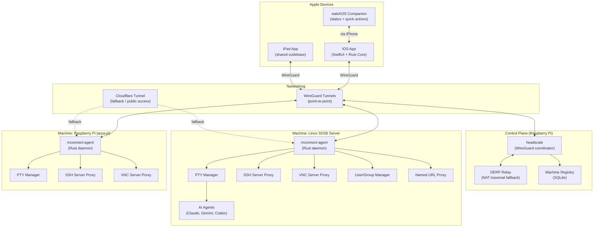
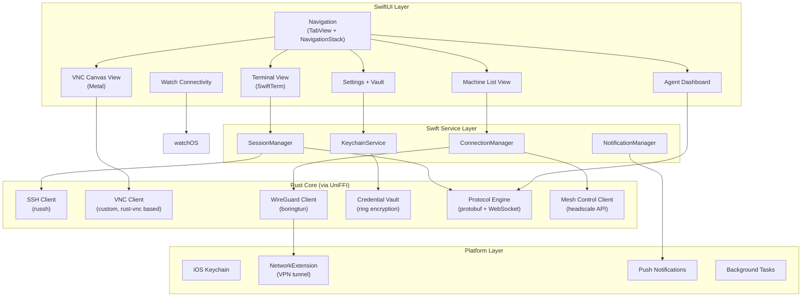
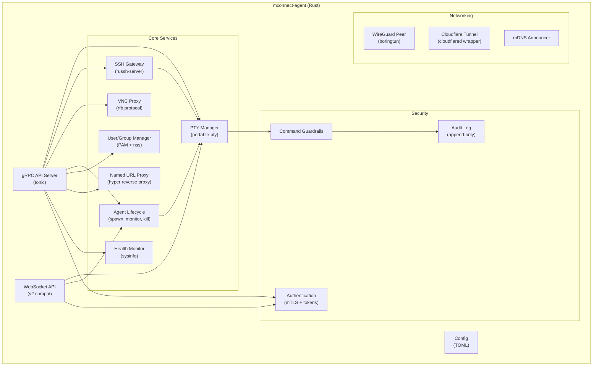
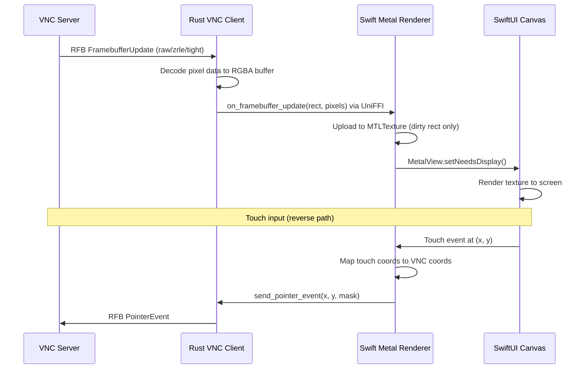
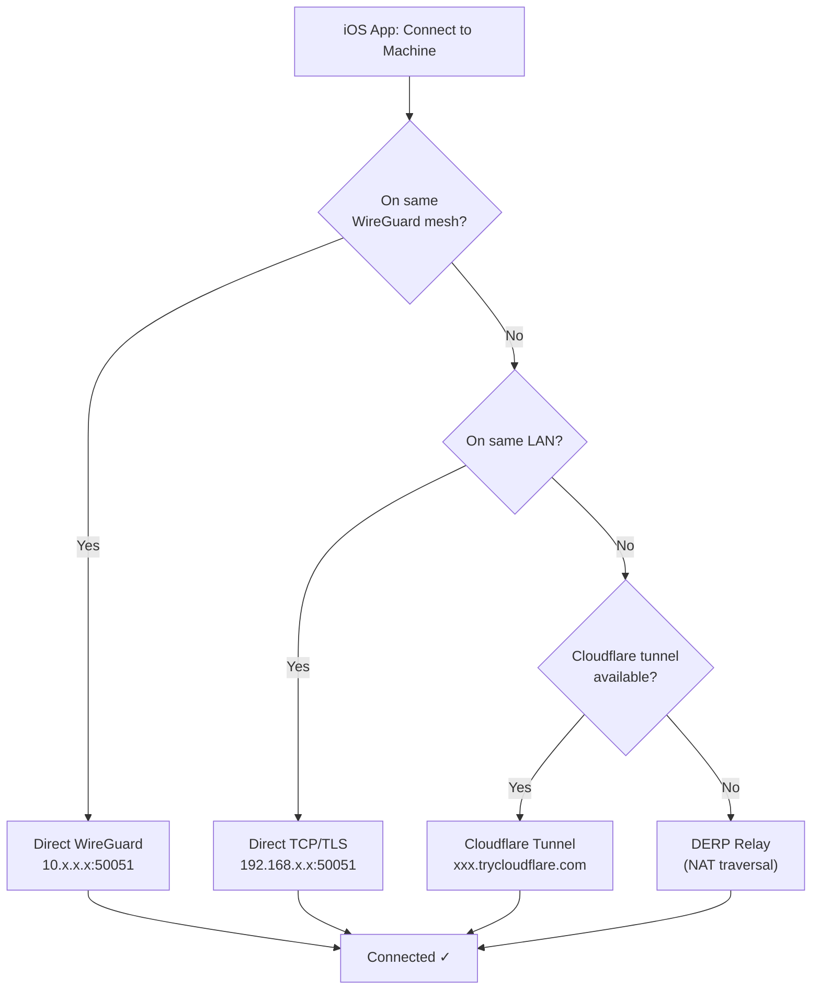
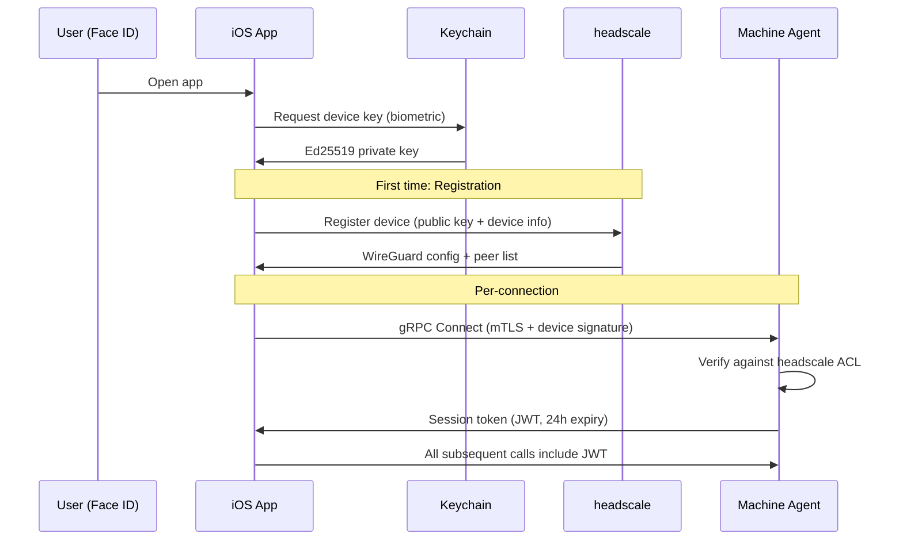
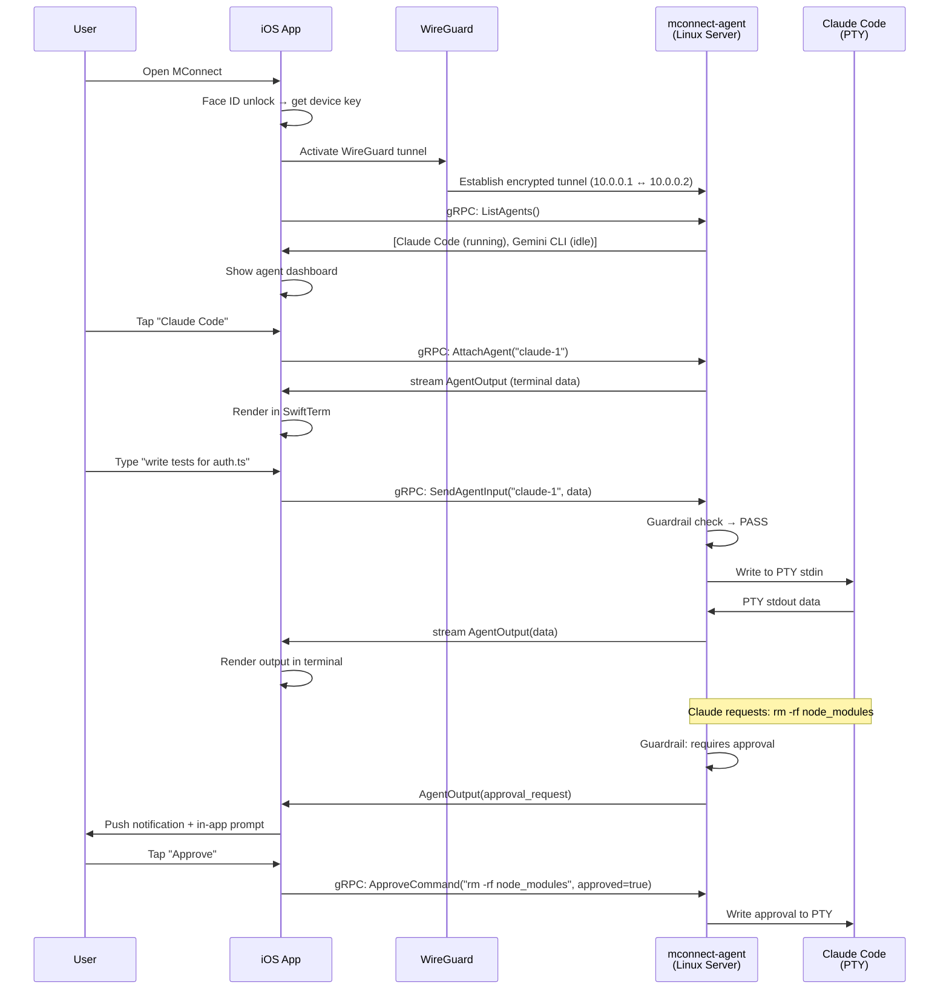
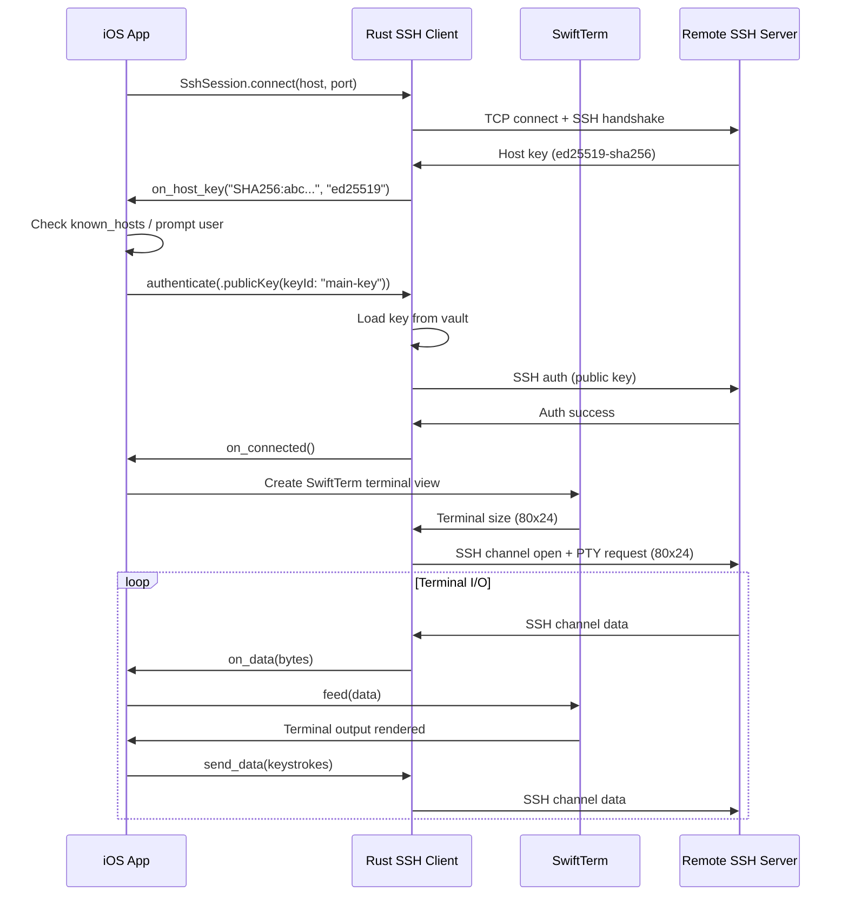
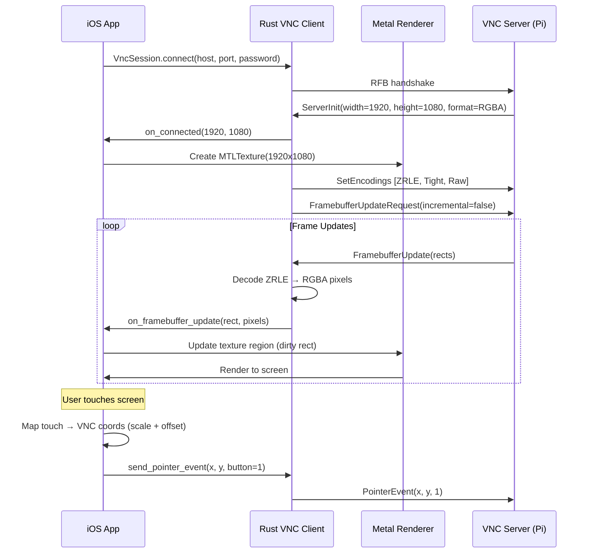
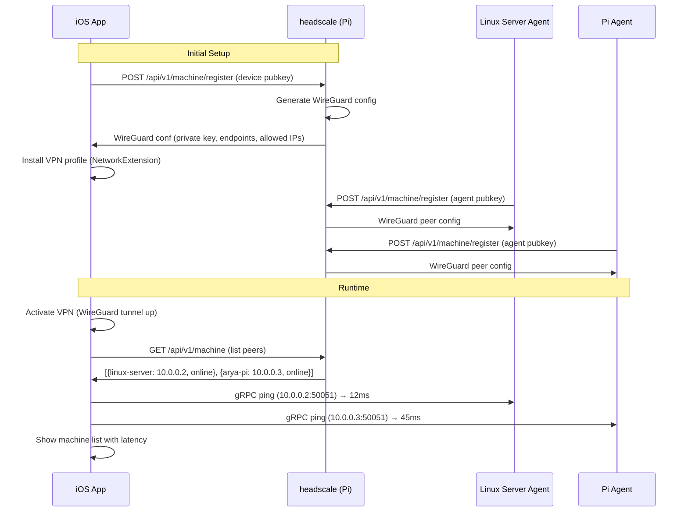

# LeCoder MConnect — System Architecture

> **Version**: 1.0.0 — March 2026  
> **Status**: Design specification  
> **Scope**: Single iOS app replacing Termius + Tailscale + RealVNC Viewer + AI agent control

---

## Table of Contents

1. [Executive Summary](#1-executive-summary)
2. [Component Architecture](#2-component-architecture)
3. [Technology Decisions](#3-technology-decisions)
4. [Protocol Design](#4-protocol-design)
5. [Security Model](#5-security-model)
6. [Data Flows](#6-data-flows)
7. [Subsystem Deep Dives](#7-subsystem-deep-dives)
8. [Phased Roadmap](#8-phased-roadmap)
9. [Migration Path for Existing Code](#9-migration-path-for-existing-code)

---

## 1. Executive Summary

MConnect consolidates five separate tools into a single native iOS app backed by a Rust machine agent:

| Replaced Tool | MConnect Equivalent |
|---|---|
| Termius | Native SSH terminal (SwiftTerm + russh) |
| Tailscale | WireGuard mesh via headscale control plane |
| RealVNC Viewer | Rust VNC client rendering via Metal |
| Multiple AI CLIs | Unified agent monitor with PTY control |
| Manual sysadmin | Declarative user/group management |

The system has three tiers:

```
┌──────────────┐     ┌──────────────────┐     ┌────────────────────┐
│  iOS App     │────▶│  Control Plane    │────▶│  Machine Agent(s)  │
│  (Swift+Rust)│     │  (headscale/Pi)   │     │  (Rust daemon)     │
└──────────────┘     └──────────────────┘     └────────────────────┘
   iPhone/iPad/          Coordination            Linux/Mac servers
   Apple Watch           + DERP relay
```

---

## 2. Component Architecture

### 2.1 System-Level Component Diagram



### 2.2 iOS App Internal Architecture



### 2.3 Machine Agent Internal Architecture



---

## 3. Technology Decisions

### 3.1 Decision Matrix

| Component | Technology | Alternatives Considered | Rationale |
|---|---|---|---|
| **iOS UI** | SwiftUI | UIKit, React Native | Native perf, Watch support, platform APIs |
| **iOS Terminal** | SwiftTerm | WebView + xterm.js, TerminalUI | Pure Swift, no WebView overhead, Miguel de Icaza (Mono/Xamarin creator) maintains it, SSH integration |
| **Swift ↔ Rust Bridge** | UniFFI | cbindgen, swift-bridge, manual C FFI | Mozilla-backed, generates Swift bindings from Rust UDL, handles memory safety, async support |
| **SSH Client** | russh (Rust) | libssh2-sys, Thrussh | Pure Rust (no C deps), async/await, actively maintained, SFTP support |
| **SSH Server** | russh (server mode) | OpenSSH wrapper | Same crate, protocol consistency, embedded in agent |
| **VNC Client** | Custom Rust (rfb crate + Metal) | rust-vnc fork, libvncserver | rust-vnc is a starting point but needs iOS optimization; decode in Rust, render in Metal |
| **WireGuard** | boringtun (Rust) | wireguard-go, system WireGuard | Userspace Rust impl by Cloudflare, embeddable, iOS NetworkExtension compatible |
| **Mesh Control** | headscale | Custom, Nebula, ZeroTier | Open-source Tailscale-compatible control server, Go, mature, DERP relay support |
| **Agent Protocol** | gRPC (tonic) | WebSocket JSON, Cap'n Proto | Typed protobuf schemas, bidirectional streaming, HTTP/2, code generation |
| **Agent Compat** | WebSocket v2 | Drop legacy | Existing web app and pairing flow still works during migration |
| **PTY (Rust)** | portable-pty | pty-process, nix | Cross-platform (Linux+Mac), well-tested, Wez Furlong (wezterm author) |
| **User Management** | PAM + nss_db | Direct /etc/passwd, LDAP | Standard Linux auth, supports 2FA extension, audit-friendly |
| **Named URLs** | hyper reverse proxy | nginx, caddy | Embedded in agent, no external dependency, programmatic control |
| **Credential Store** | ring (Rust) + iOS Keychain | sodiumoxide, RustCrypto | ring is audited, hardware-backed key derivation on iOS via Keychain bridge |
| **Config** | TOML | YAML, JSON | Rust ecosystem standard, human-readable, serde support |
| **Observability** | Opik (existing) + OpenTelemetry | Datadog, custom | Hackathon requirement, OTel for agent-side metrics |

### 3.2 Where Rust Lives

```
mconnect-rust/
├── Cargo.toml                    # Workspace root
├── crates/
│   ├── mconnect-core/            # Shared types, config, errors
│   ├── mconnect-ssh/             # SSH client + server (russh wrapper)
│   ├── mconnect-vnc/             # VNC client + proxy (rfb protocol)
│   ├── mconnect-mesh/            # WireGuard + headscale client
│   ├── mconnect-pty/             # PTY management (portable-pty wrapper)
│   ├── mconnect-vault/           # Credential encryption (ring)
│   ├── mconnect-agent/           # Machine agent daemon (gRPC server)
│   ├── mconnect-proxy/           # Named URL reverse proxy
│   ├── mconnect-usermgr/         # PAM/user/group management
│   ├── mconnect-guardrails/      # Command safety (port of TS guardrails)
│   └── mconnect-ios/             # UniFFI bindings for Swift
│       ├── src/lib.rs            # Exposed API surface
│       └── src/mconnect.udl      # UniFFI interface definition
└── target/
```

### 3.3 UniFFI Bridge Design

The UniFFI `.udl` file defines what Swift sees:

```webidl
// mconnect.udl — UniFFI interface definition

namespace mconnect {
    // Initialization
    void init_logging(LogLevel level);
};

[Enum]
interface LogLevel { Debug; Info; Warn; Error; };

// SSH
interface SshSession {
    [Throws=MConnectError]
    constructor(SshConfig config);

    [Throws=MConnectError]
    void connect();

    [Throws=MConnectError]
    void authenticate(AuthMethod method);

    void send_data(bytes data);
    void resize(u16 cols, u16 rows);
    void disconnect();
};

callback interface SshSessionDelegate {
    void on_data(bytes data);
    void on_connected();
    void on_disconnected(string reason);
    void on_host_key(string fingerprint, string key_type);
    void on_error(MConnectError error);
};

// VNC
interface VncSession {
    [Throws=MConnectError]
    constructor(VncConfig config);

    [Throws=MConnectError]
    void connect();

    void send_pointer_event(u16 x, u16 y, u8 button_mask);
    void send_key_event(u32 key, boolean down);
    void request_framebuffer_update(boolean incremental);
    void disconnect();
};

callback interface VncSessionDelegate {
    void on_framebuffer_update(FrameRect rect, bytes pixels);
    void on_connected(u16 width, u16 height);
    void on_disconnected(string reason);
};

// Credential Vault
interface CredentialVault {
    [Throws=MConnectError]
    constructor(string encryption_key_id);

    [Throws=MConnectError]
    void store_credential(Credential cred);

    [Throws=MConnectError]
    Credential? get_credential(string id);

    [Throws=MConnectError]
    sequence<CredentialSummary> list_credentials();

    [Throws=MConnectError]
    void delete_credential(string id);
};

// Mesh
interface MeshClient {
    [Throws=MConnectError]
    constructor(MeshConfig config);

    [Throws=MConnectError]
    void connect_to_control_plane();

    [Throws=MConnectError]
    sequence<MeshPeer> list_peers();

    [Throws=MConnectError]
    void connect_peer(string peer_id);
};

// Agent Protocol
interface AgentClient {
    [Throws=MConnectError]
    constructor(string endpoint, string token);

    [Throws=MConnectError]
    void connect();

    [Throws=MConnectError]
    sequence<AgentInfo> list_agents();

    void send_input(string agent_id, bytes data);
    void resize_agent(string agent_id, u16 cols, u16 rows);
};

callback interface AgentClientDelegate {
    void on_agent_output(string agent_id, bytes data);
    void on_agent_list(sequence<AgentInfo> agents);
    void on_agent_status_change(string agent_id, AgentStatus status);
    void on_error(MConnectError error);
};
```

Swift usage (generated by UniFFI):

```swift
import MConnectRust

let ssh = try SshSession(config: SshConfig(
    host: "192.168.1.50",
    port: 22,
    username: "arya"
))

ssh.setDelegate(self)
try ssh.connect()
try ssh.authenticate(method: .publicKey(keyId: "main-key"))
```

### 3.4 VNC Rendering Pipeline



---

## 4. Protocol Design

### 4.1 Protocol Layers

```
┌─────────────────────────────────────────────┐
│ Application: gRPC services (protobuf)       │  ← Typed RPC + streaming
├─────────────────────────────────────────────┤
│ Session: mTLS + token auth                  │  ← Per-connection auth
├─────────────────────────────────────────────┤
│ Transport: WireGuard (primary)              │  ← Encrypted tunnel
│           Cloudflare Tunnel (fallback)      │
│           Direct TCP/TLS (LAN)              │
├─────────────────────────────────────────────┤
│ Network: UDP (WireGuard) / TCP (fallback)   │
└─────────────────────────────────────────────┘
```

### 4.2 gRPC Service Definitions

```protobuf
syntax = "proto3";
package mconnect.v1;

// Machine management
service MachineService {
    rpc GetInfo(Empty) returns (MachineInfo);
    rpc GetHealth(Empty) returns (HealthReport);
    rpc ListNamedUrls(Empty) returns (NamedUrlList);
    rpc CreateNamedUrl(NamedUrlConfig) returns (NamedUrl);
    rpc DeleteNamedUrl(NamedUrlId) returns (Empty);
}

// Terminal / PTY sessions
service TerminalService {
    rpc CreateSession(TerminalConfig) returns (TerminalSession);
    rpc AttachSession(SessionId) returns (stream TerminalData);
    rpc SendInput(stream TerminalInput) returns (Empty);
    rpc ResizeSession(ResizeRequest) returns (Empty);
    rpc ListSessions(Empty) returns (SessionList);
    rpc DestroySession(SessionId) returns (Empty);
}

// AI Agent management
service AgentService {
    rpc ListAgents(Empty) returns (stream AgentList);
    rpc SpawnAgent(AgentConfig) returns (AgentInfo);
    rpc KillAgent(AgentId) returns (Empty);
    rpc AttachAgent(AgentId) returns (stream AgentOutput);
    rpc SendAgentInput(AgentInput) returns (InputResult);
    rpc ApproveCommand(ApprovalResponse) returns (Empty);
}

// SSH gateway
service SshService {
    rpc Connect(SshConnectRequest) returns (SshSession);
    rpc ForwardPort(PortForwardRequest) returns (PortForwardInfo);
    rpc ListKeys(Empty) returns (SshKeyList);
}

// VNC proxy
service VncService {
    rpc Connect(VncConnectRequest) returns (VncSession);
    rpc GetFramebuffer(stream FramebufferRequest)
        returns (stream FramebufferUpdate);
    rpc SendInput(stream VncInput) returns (Empty);
}

// User/Group management
service UserService {
    rpc ListUsers(Empty) returns (UserList);
    rpc CreateUser(CreateUserRequest) returns (User);
    rpc DeleteUser(UserId) returns (Empty);
    rpc SetUserQuota(UserQuotaRequest) returns (Empty);
    rpc ListGroups(Empty) returns (GroupList);
    rpc CreateGroup(CreateGroupRequest) returns (Group);
    rpc AssignUserToGroup(UserGroupAssignment) returns (Empty);
}

// Observability
service ObservabilityService {
    rpc GetAgentTraces(TraceQuery) returns (stream TraceEvent);
    rpc GetMetrics(MetricsQuery) returns (MetricsReport);
}
```

### 4.3 Backward Compatibility — WebSocket v2

The existing WebSocket protocol (v2.0) is preserved as a compatibility layer:

```
iOS App ──gRPC──▶ mconnect-agent (Rust)
                     │
                     ├──gRPC──▶ PTY/Agents (native)
                     │
                     └──WS v2──▶ Legacy Node.js CLI (bridge mode)

Web App ──WS v2──▶ mconnect-agent (Rust) ──▶ PTY/Agents
                     │
                     └──WS v2──▶ Legacy Node.js CLI (bridge mode)
```

The Rust agent includes a WebSocket v2 endpoint that:
- Accepts the existing protocol messages (`session_attach`, `terminal_input`, etc.)
- Routes them to the native Rust PTY manager
- Optionally proxies to a running Node.js CLI process for backward compat

### 4.4 Transport Selection Logic



---

## 5. Security Model

### 5.1 Trust Hierarchy

```
Root of Trust
├── iOS Device
│   ├── Secure Enclave (device keypair, Ed25519)
│   ├── Keychain (credential vault master key)
│   └── Biometric gate (Face ID / Touch ID)
│
├── Control Plane (headscale on Pi)
│   ├── WireGuard pre-shared keys
│   ├── Machine registration tokens
│   └── ACL policies
│
└── Machine Agent
    ├── WireGuard peer key (derived at registration)
    ├── mTLS certificate (signed by control plane CA)
    └── Local credential store (encrypted at rest)
```

### 5.2 Authentication Flow



### 5.3 Credential Vault Design

```
┌───────────────────────────────────────────┐
│ iOS Keychain (hardware-backed)            │
│  ├── device_ed25519_private_key           │
│  ├── vault_master_key (256-bit AES)       │
│  └── biometric_gate (Face ID required)    │
└───────────────────────────────────────────┘
         │ unlocks
         ▼
┌───────────────────────────────────────────┐
│ Encrypted Vault (App Sandbox, SQLite)     │
│  Header: salt + nonce + AEAD tag          │
│  ├── ssh_key:main-server (encrypted blob) │
│  ├── ssh_key:pi (encrypted blob)          │
│  ├── password:vnc-server (encrypted blob) │
│  └── token:cloudflare (encrypted blob)    │
│                                           │
│  Encryption: AES-256-GCM                  │
│  KDF: HKDF-SHA256(master_key, per_entry)  │
│  Each entry has unique derived key        │
└───────────────────────────────────────────┘
```

**Properties:**
- Master key never leaves Secure Enclave
- Each credential entry encrypted with a unique derived key (HKDF)
- Vault database is useless without biometric unlock
- No cloud sync — credentials are device-local
- Export requires explicit biometric confirmation + encryption

### 5.4 Command Guardrails (Extended)

Existing TypeScript guardrails are ported to Rust and extended:

| Level | SSH | VNC | Agent |
|---|---|---|---|
| `strict` | Blocklist (rm -rf, dd, etc.), require approval for sudo | View-only, no input | Read-only, no command execution |
| `default` | Blocklist dangerous commands, audit all | Full control with audit | Approval for destructive commands |
| `permissive` | Audit only, no blocking | Full control | Full control with audit |
| `none` | No restrictions | No restrictions | No restrictions |

### 5.5 Audit Trail

Every interaction is logged to an append-only audit log on the machine agent:

```
{
  "ts": "2026-03-02T15:30:00Z",
  "device_id": "iphone-arya-abc123",
  "session_type": "ssh",
  "target": "linux-server:22",
  "action": "command_executed",
  "command": "sudo apt update",
  "guardrail_result": "approved_after_prompt",
  "ip": "10.0.0.5"
}
```

---

## 6. Data Flows

### 6.1 Opening App → Controlling an AI Agent



### 6.2 SSH Connection Flow



### 6.3 VNC Connection Flow



### 6.4 Mesh Network Setup Flow



---

## 7. Subsystem Deep Dives

### 7.1 Headscale Mesh Networking

**Why headscale over custom WireGuard mesh?**
- Tailscale-compatible — existing Tailscale clients work unchanged during migration
- DERP relay built in — handles NAT traversal without custom STUN/TURN
- ACL policies — control which devices can reach which services
- MagicDNS — machines reachable by name (e.g., `linux-server.mesh.local`)
- Go binary — runs on the Raspberry Pi with minimal resources

**Deployment:**

```toml
# /etc/headscale/config.yaml (on Raspberry Pi)
server_url: https://mesh.arya-pi.local
listen_addr: 0.0.0.0:443
private_key_path: /var/lib/headscale/private.key
db_type: sqlite3
db_path: /var/lib/headscale/db.sqlite

dns_config:
  base_domain: mesh.local
  magic_dns: true
  nameservers:
    - 1.1.1.1

derp:
  server:
    enabled: true
    region_id: 900
    stun_listen_addr: 0.0.0.0:3478
```

**iOS Integration:**
- Use `NetworkExtension` framework with `NEPacketTunnelProvider`
- Embed boringtun (Rust WireGuard) compiled for iOS
- VPN profile auto-activates when app opens
- Stays active in background (system VPN)

### 7.2 VNC Implementation

**Architecture:**
- Port the core RFB (Remote Framebuffer) protocol from rust-vnc
- Support encodings: Raw, CopyRect, ZRLE, Tight (covers 99% of VNC servers)
- Decode to RGBA8 pixel buffers in Rust
- Transfer pixel data to Swift via UniFFI (zero-copy where possible via shared memory)
- Render using MetalKit (MTKView) for GPU-accelerated compositing

**Touch → Mouse Mapping:**

| iOS Gesture | VNC Action |
|---|---|
| Single tap | Left click |
| Long press | Right click |
| Two-finger tap | Right click (alt) |
| Pan (one finger) | Mouse move |
| Pinch | Zoom viewport (local only) |
| Two-finger pan | Scroll |
| Three-finger tap | Toggle keyboard |

**Performance targets:**
- 30 FPS at 1080p over WireGuard LAN
- < 50ms input latency
- Incremental updates only (dirty rects)

### 7.3 User/Group Management

The machine agent manages OS-level users for AI agent isolation:

```
mconnect-agent
  └── UserManager
       ├── create_user(name, config)
       │    → useradd --system --shell /bin/bash
       │    → Create home directory
       │    → Set resource limits (cgroup v2)
       │    → Generate SSH keypair
       │    → Add to mconnect-agents group
       │
       ├── create_agent_sandbox(user, agent_type)
       │    → Create dedicated workspace dir
       │    → Set filesystem quotas
       │    → Configure network namespace (optional)
       │    → Install agent binary/symlink
       │
       ├── list_users()
       │    → Read /etc/passwd, filter mconnect-agents group
       │    → Get cgroup resource usage per user
       │
       └── delete_user(name)
            → Kill all user processes
            → Archive home directory
            → userdel --remove
```

**Example: Creating an isolated Claude Code agent:**

```
iOS App → gRPC: CreateUser({
    name: "claude-agent-1",
    agent_type: "claude-code",
    quota: { cpu_shares: 1024, memory_mb: 4096, disk_gb: 10 },
    ssh_access: true
})

Agent:
  1. useradd --system -m -s /bin/bash -G mconnect-agents claude-agent-1
  2. mkdir -p /home/claude-agent-1/workspace
  3. ssh-keygen -t ed25519 -f /home/claude-agent-1/.ssh/id_ed25519 -N ""
  4. cgcreate -g cpu,memory:/mconnect/claude-agent-1
  5. cgset -r cpu.shares=1024 /mconnect/claude-agent-1
  6. cgset -r memory.max=4294967296 /mconnect/claude-agent-1
  7. setquota -u claude-agent-1 0 10G 0 0 /home
```

### 7.4 Named URL Proxy (Portless)

Inspired by Vercel's Portless concept — maps human-readable names to local ports:

```
myapp.dev.local     →  localhost:3000
api.dev.local       →  localhost:8080
storybook.dev.local →  localhost:6006
```

**Implementation in the machine agent:**

```toml
# /etc/mconnect/named-urls.toml

[[url]]
name = "myapp"
target = "127.0.0.1:3000"
domain = "myapp.dev.arya-server"  # Auto-registered in headscale DNS

[[url]]
name = "api"
target = "127.0.0.1:8080"
domain = "api.dev.arya-server"
```

The agent runs a reverse proxy (hyper) that:
1. Listens on port 443 with a wildcard TLS cert (self-signed CA or Let's Encrypt)
2. Routes by SNI/Host header to the target port
3. Registers DNS records in headscale (MagicDNS)
4. iOS app shows named URLs in machine detail view with one-tap open in Safari

### 7.5 Apple Watch Companion

Minimal Watch app focused on status and quick actions:

**Screens:**
1. **Machine List** — Online/offline status, latency indicators
2. **Agent Status** — Running agents with activity indicators
3. **Quick Actions** — Kill agent, restart agent, approve pending command
4. **Notifications** — Agent completion, connection drops, approval requests

**Architecture:**
- Uses Watch Connectivity framework
- iPhone app relays data (Watch doesn't connect to WireGuard directly)
- Complications: show active agent count, connection status

---

## 8. Phased Roadmap

### Phase 1: TestFlight v1 — Hybrid Fix (3-4 weeks)

**Goal:** Ship a working app to TestFlight. Fix current breakage, polish connect flow.

| Task | Details | Effort |
|---|---|---|
| Fix hardcoded tunnel URL | Remove `enableAutoConnectForTesting`, fix SessionStore | 1 day |
| Tailscale IP support | Accept `http://100.x.x.x:8765` (Tailscale IPs) in connect flow | 1 day |
| Health check before connect | Hit `/health` before loading WebView, show error if unreachable | 2 days |
| Connection persistence | Remember last working connection, auto-reconnect | 2 days |
| App Store metadata | Screenshots, privacy description, app category | 2 days |
| Native error states | Replace WebView errors with native SwiftUI error views | 2 days |
| Basic push notifications | APNs setup, notify on disconnect/reconnect | 3 days |
| Saved machines list | Store machine name + URL + last seen, show in connect screen | 2 days |
| iPad layout | Sidebar navigation for iPad | 2 days |
| TestFlight submission | Build, sign, upload, invite testers | 1 day |

**Architecture at this phase:**
```
iOS App (SwiftUI connect + WKWebView terminal)
    │
    ├── Direct IP (Tailscale mesh)──▶ Node.js CLI (existing)
    │
    └── Cloudflare Tunnel ──▶ Node.js CLI (existing)
```

**Deliverable:** Working TestFlight build. Users can connect via QR, pairing code, or saved Tailscale IP.

---

### Phase 2: Native Terminal + SSH (6-8 weeks)

**Goal:** Replace WebView with native terminal. Add SSH support. Start Rust integration.

| Task | Details | Effort |
|---|---|---|
| Integrate SwiftTerm | Native terminal emulator view, replace WKWebView | 1 week |
| Rust core scaffold | Cargo workspace, UniFFI setup, build scripts for iOS | 1 week |
| SSH client (russh via UniFFI) | Connect, authenticate (password + key), shell session | 2 weeks |
| Credential vault | Keychain-backed encrypted store, SSH key management | 1 week |
| Native WebSocket client | Direct WS connection to CLI (no WebView) | 3 days |
| Multi-terminal tabs | Tab bar for multiple sessions (SSH + agent) | 3 days |
| Known hosts management | Host key verification, trust-on-first-use | 2 days |
| SFTP file browser | Basic file listing, upload, download via SSH | 1 week |
| Connection profiles | Save SSH configs (host, user, key, port) | 2 days |

**Architecture at this phase:**
```
iOS App (SwiftUI + SwiftTerm + Rust SSH)
    │
    ├── SSH (russh) ──────────────────▶ Any SSH server
    │
    ├── WebSocket (native) ──▶ Node.js CLI (agent control)
    │    via Tailscale IP or Cloudflare Tunnel
    │
    └── Credential Vault (Rust + Keychain)
```

**Deliverable:** Native terminal SSH client that replaces Termius for basic use cases. Agent control still via WebSocket to Node.js CLI.

---

### Phase 3: Machine Agent + Mesh (8-10 weeks)

**Goal:** Deploy Rust machine agent. Add WireGuard mesh. Full agent control natively.

| Task | Details | Effort |
|---|---|---|
| mconnect-agent scaffold | Rust daemon with gRPC server (tonic) | 1 week |
| PTY manager (Rust) | portable-pty integration, agent spawning | 1 week |
| gRPC terminal service | Create/attach/input/resize sessions | 1 week |
| gRPC agent service | List/spawn/kill/attach agents | 1 week |
| WS v2 compatibility layer | Bridge existing web app to Rust agent | 3 days |
| headscale deployment | Install on Pi, configure, register machines | 3 days |
| iOS WireGuard integration | NetworkExtension + boringtun, VPN profile | 1 week |
| Machine discovery | Auto-discover machines via headscale API | 3 days |
| User/group management | PAM integration, cgroup isolation | 1 week |
| Agent observability (Opik) | Port Opik tracing to Rust agent | 3 days |
| Named URL proxy | hyper reverse proxy + headscale DNS | 3 days |
| iOS gRPC client | Replace WebSocket with gRPC for agent control | 1 week |

**Architecture at this phase:**
```
iOS App (SwiftUI + SwiftTerm + Rust Core)
    │
    ├── WireGuard ──▶ headscale (Pi) ──▶ Machine discovery
    │
    ├── gRPC ──▶ mconnect-agent (Rust) ──▶ PTY/Agents
    │
    ├── SSH (russh) ──▶ Any SSH server
    │
    └── Cloudflare Tunnel (fallback for external access)

Node.js CLI: still available, bridged by Rust agent's WS v2 endpoint
```

**Deliverable:** Self-hosted mesh network. Rust agent manages machines. Node.js CLI becomes optional.

---

### Phase 4: VNC + Watch + Full Vision (6-8 weeks)

**Goal:** Complete the vision. VNC, Watch app, enterprise features.

| Task | Details | Effort |
|---|---|---|
| VNC client (Rust) | RFB protocol, ZRLE/Tight decoding | 2 weeks |
| Metal VNC renderer | GPU-composited framebuffer, touch mapping | 1 week |
| VNC in machine agent | Proxy/server mode for headless machines | 1 week |
| Apple Watch companion | Status, quick actions, complications | 1 week |
| Multi-device sync | Share machine list across iPhone + iPad (CloudKit) | 3 days |
| Port forwarding UI | SSH port forwards, visualize tunnels | 3 days |
| Guardrails v2 (Rust) | Full port of TS guardrails + policy engine | 1 week |
| Audit dashboard | View audit logs from machine agents | 3 days |
| Enterprise: team sharing | Share machine access with team members | 1 week |
| App Store submission | Full review compliance, screenshots, privacy | 3 days |

**Architecture at this phase:**
```
iOS App + iPad App + Apple Watch
    │
    ├── WireGuard mesh (headscale)
    │
    ├── gRPC ──▶ mconnect-agent (Rust)
    │              ├── PTY / AI Agents
    │              ├── SSH gateway
    │              ├── VNC proxy
    │              ├── User management
    │              ├── Named URL proxy
    │              └── Audit + Observability
    │
    ├── SSH (direct, russh)
    ├── VNC (direct, Rust client)
    └── Credential vault (Keychain + Rust)
```

---

## 9. Migration Path for Existing Code

### 9.1 Node.js CLI Evolution

| Phase | CLI Role | Changes |
|---|---|---|
| **Phase 1** | Primary backend | No changes, iOS connects via WS |
| **Phase 2** | Primary for agents, SSH separate | iOS uses native SSH; CLI still serves agent WebSocket |
| **Phase 3** | Optional, bridged | Rust agent is primary. CLI can still run, agent proxies WS v2 to it |
| **Phase 4** | Deprecated for iOS | CLI remains for non-iOS users (web app, dev testing). Not required for iOS app |

The CLI is **never removed** — it remains useful for:
- Web app users (existing xterm.js UI)
- Quick local development (`mconnect start` still works)
- CI/CD pipelines
- Users who don't use the iOS app

### 9.2 Web App Evolution

| Phase | Web App Role |
|---|---|
| **Phase 1** | Primary terminal UI (loaded in WKWebView) |
| **Phase 2** | Backup UI, used when native terminal unavailable |
| **Phase 3** | Standalone web client, connects to Rust agent via WS v2 |
| **Phase 4** | Optional companion for desktop users |

### 9.3 Code Reuse

| Existing Code | Reuse Strategy |
|---|---|
| `guardrails.ts` | Port to Rust (`mconnect-guardrails` crate), keep TS version for CLI/web |
| `ws/protocol.ts` | Rust agent implements same protocol; shared `.proto` definition generates both |
| `agents/types.ts` | Agent presets defined in shared protobuf |
| `security.ts` | Token generation moves to Rust; pairing flow kept in both |
| `tunnel.ts` | Cloudflare tunnel wrapper kept in CLI; agent has its own |
| `session.ts` | Session orchestration moves to Rust agent; CLI keeps its version |
| iOS `ContentView.swift` | Evolves: connect screen stays, WebView replaced by SwiftTerm |
| iOS `QRScannerSheet` | Kept and enhanced with machine registration flow |

---

## Appendix A: Repository Structure (Target State)

```
lecoder-mconnect/
├── packages/
│   ├── cli/                    # Node.js CLI (maintained)
│   └── shared/                 # Shared types (protobuf source)
│       └── proto/              # .proto files (source of truth)
│
├── rust/                       # Rust workspace
│   ├── Cargo.toml
│   └── crates/
│       ├── mconnect-core/
│       ├── mconnect-ssh/
│       ├── mconnect-vnc/
│       ├── mconnect-mesh/
│       ├── mconnect-pty/
│       ├── mconnect-vault/
│       ├── mconnect-agent/     # Machine agent binary
│       ├── mconnect-proxy/
│       ├── mconnect-usermgr/
│       ├── mconnect-guardrails/
│       └── mconnect-ios/       # UniFFI bindings → XCFramework
│
├── ios/                        # Xcode project
│   ├── MConnect/               # iOS app
│   ├── MConnectWatch/          # watchOS app
│   ├── MConnectTunnel/         # NetworkExtension (WireGuard)
│   └── MConnect.xcodeproj
│
├── apps/
│   ├── web/                    # Next.js web app (maintained)
│   └── website/                # Marketing site
│
├── docs/
│   ├── ARCHITECTURE.md         # This document
│   └── PROTOCOL.md             # Protocol specification
│
└── infra/
    ├── headscale/              # headscale config + Docker compose
    └── agent/                  # Agent deployment scripts
```

## Appendix B: Key Crate Versions (Rust)

| Crate | Version | Purpose |
|---|---|---|
| `tokio` | 1.x | Async runtime |
| `tonic` | 0.12+ | gRPC framework |
| `prost` | 0.13+ | Protobuf codegen |
| `russh` | 0.45+ | SSH client + server |
| `portable-pty` | 0.8+ | PTY management |
| `boringtun` | 0.6+ | WireGuard (Cloudflare) |
| `ring` | 0.17+ | Cryptography |
| `uniffi` | 0.28+ | Swift FFI generation |
| `hyper` | 1.x | HTTP/reverse proxy |
| `serde` | 1.x | Serialization |
| `tracing` | 0.1+ | Structured logging |
| `sysinfo` | 0.31+ | System health monitoring |

## Appendix C: iOS Frameworks Used

| Framework | Purpose |
|---|---|
| `SwiftUI` | UI layer |
| `SwiftTerm` | Terminal emulator (SPM) |
| `NetworkExtension` | WireGuard VPN tunnel |
| `MetalKit` | VNC framebuffer rendering |
| `AVFoundation` | QR code scanning |
| `UserNotifications` | Push notifications |
| `WatchConnectivity` | Apple Watch data relay |
| `Security` | Keychain access |
| `LocalAuthentication` | Face ID / Touch ID |
| `CloudKit` | Multi-device machine list sync |
| `BackgroundTasks` | Background refresh |
