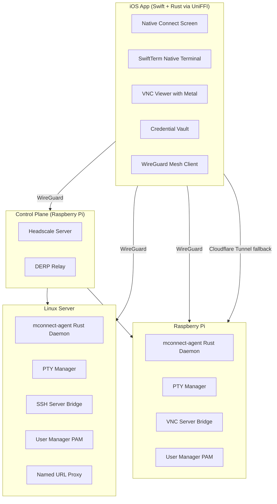

# MConnect Grand Vision: Architecture and MVP Plan

## The Problem Today

You use 3 separate apps (Termius, Tailscale, RealVNC Viewer) to manage your machines (Linux server, Raspberry Pi) and AI agents (Claude Code, Gemini CLI, Codex). The current MConnect iOS app is a WKWebView wrapper with a broken Cloudflare tunnel URL, no native terminal, and isn't ready for App Store submission.

## Target Architecture: Three-Tier System

## Phased Roadmap

### Phase 1: TestFlight v1 (3-4 weeks) -- HYBRID APP
- Fix the iOS app's connection flow (remove hardcoded expired tunnel URL)
- Support connecting via: Tailscale IP, Cloudflare tunnel URL, local IP, QR code
- Keep WKWebView terminal (it works, just needs a live URL)
- Add connection status indicators and error handling
- Add iPad layout support
- Generate required screenshots (iPhone 6.5", iPad 13")
- Fill App Store Connect requirements (privacy, pricing, copyright, export compliance)
- Set up push notifications for connection status

### Phase 2: Native Terminal + SSH (6-8 weeks)
- Integrate SwiftTerm for native terminal rendering
- Add Rust SSH client (russh) via UniFFI
- Build credential vault (Rust encryption + iOS Keychain)
- Native WebSocket client replacing WebView's network stack
- Machine list with saved connections
- iPad split-view: machine list + terminal side-by-side

### Phase 3: Machine Agent + Mesh (8-10 weeks)
- Build mconnect-agent Rust daemon for Linux machines
- Deploy headscale on Raspberry Pi as control plane
- WireGuard mesh between iOS app and all machines
- gRPC protocol between iOS and machine agents
- Named URL proxy (portless-like) in the agent
- Linux user/group management via PAM
- AI agent monitoring dashboard in iOS app

### Phase 4: Full Vision (6-8 weeks)
- VNC client: Rust decode + Metal rendering on iOS
- Apple Watch companion (connection status, quick actions)
- Live Activities for ongoing sessions
- Enterprise features: team sharing, RBAC, audit logs
- App Store public release

## App Store Submission Checklist (Phase 1)

1. Copyright information -- add to App Information
2. Export compliance -- mark as "No" (no custom encryption, uses standard HTTPS)
3. iPad 13" screenshots -- generate from simulator
4. iPhone 6.5" screenshots -- generate from simulator
5. App Privacy section -- declare camera usage (QR), network usage
6. Price tier -- set to Free
7. Content Rights -- declare no third-party content
